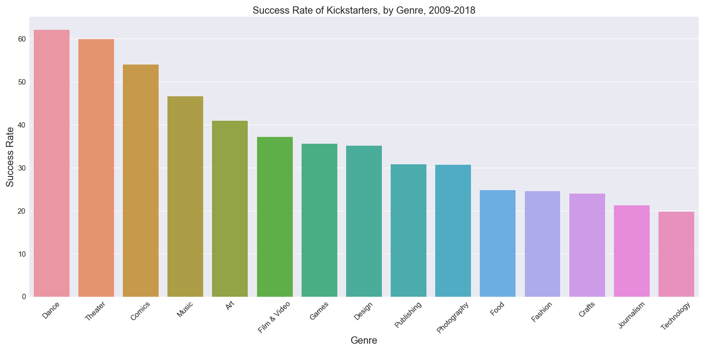
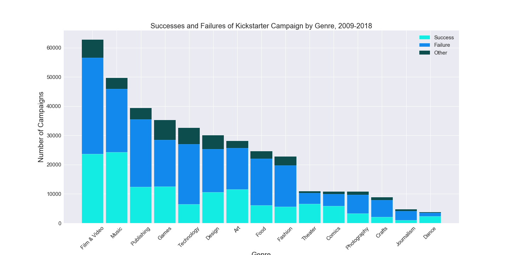
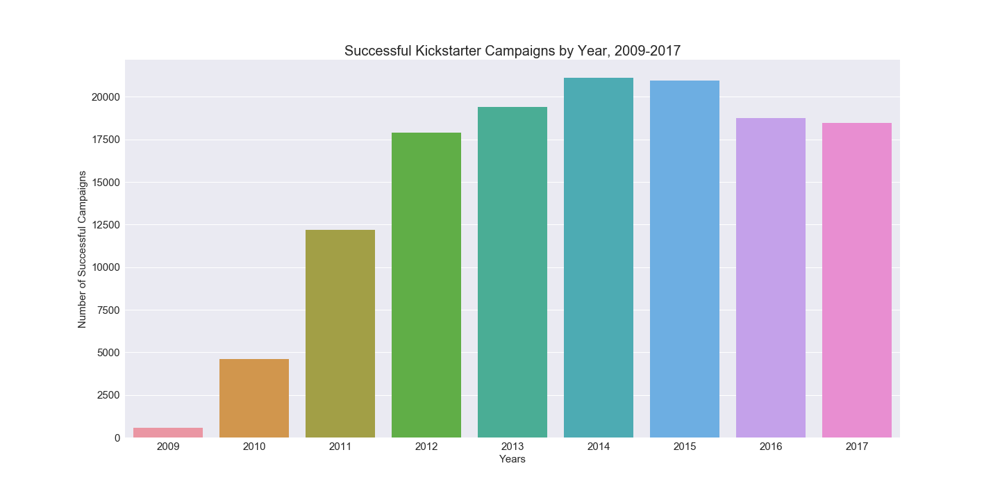
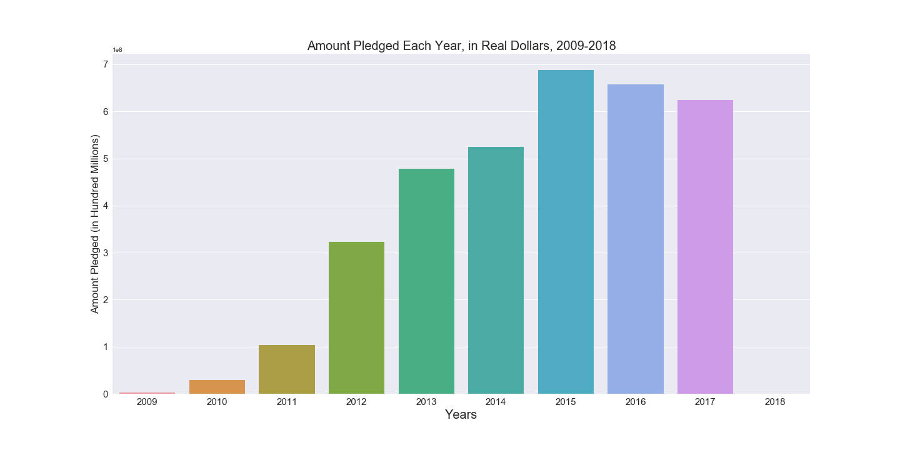
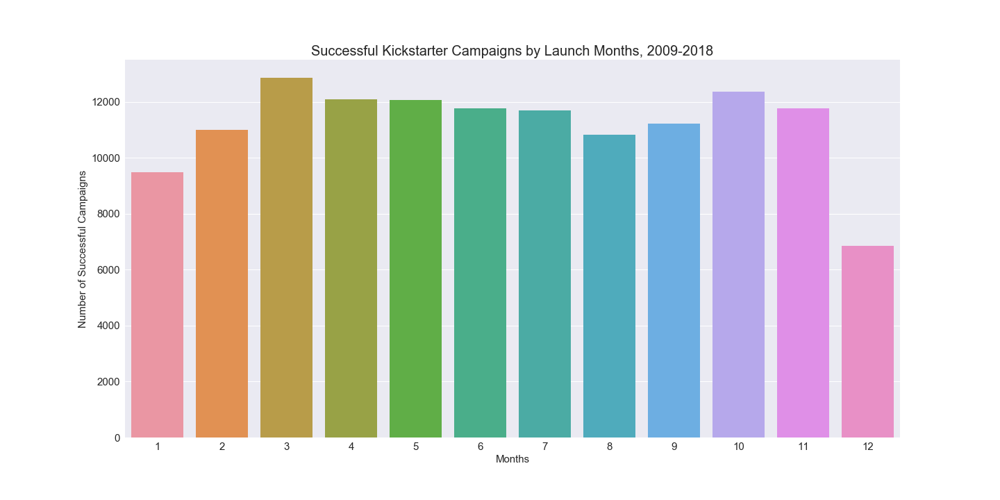
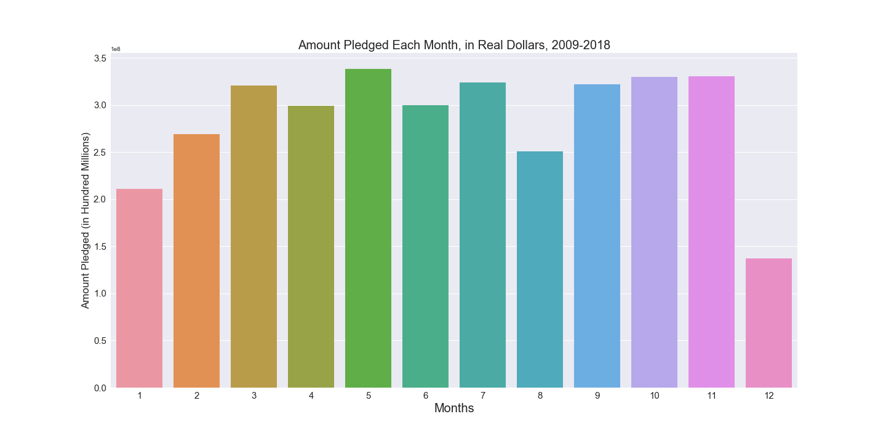

# Succeeding-With-Kickstarter
Quick analysis of different times and categories

Data from https://www.kaggle.com/kemical/kickstarter-projects

Which category might you have the best chance campaigning successfully?

Three categories have a success rate of over 50%: Dance, Theater and Comics
Lowest success rate goes to Technology. 
Possible reason: harsher critics

Total campaigns per category, measured by their successes, failures, and other reasons (suspension, cancellation, or live):

Notice that Dance, the category with the highest success rate, also has the least amount of campaigns. Maybe campaign market saturation has something to do with this?

Success by year:

We see a peak in successful campaigns in 2015, and that number has made a slight decline since then.
Are people pledging less since 2015?

As expected, the total amount pledged per year after 2015 has declined. However, it has only been two years and is too soon to make any claims.

Then what is the best month to launch a campaign?

Maybe you should launch a campaign in the beginning or end of the year. Why might this be? Are people pledging less during and a month after Christmas?

Maybe people are pledging less because they spent all their money on Christmas gifts. Or maybe there are just less worthwhile campaigns to pledge to. The total amount pledged to campaigns, regardless of whether they eventually succeeded or failed, is considerably lower around January and December. 
